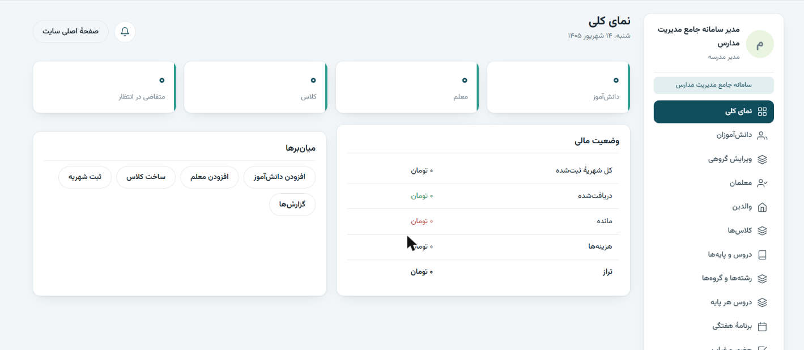
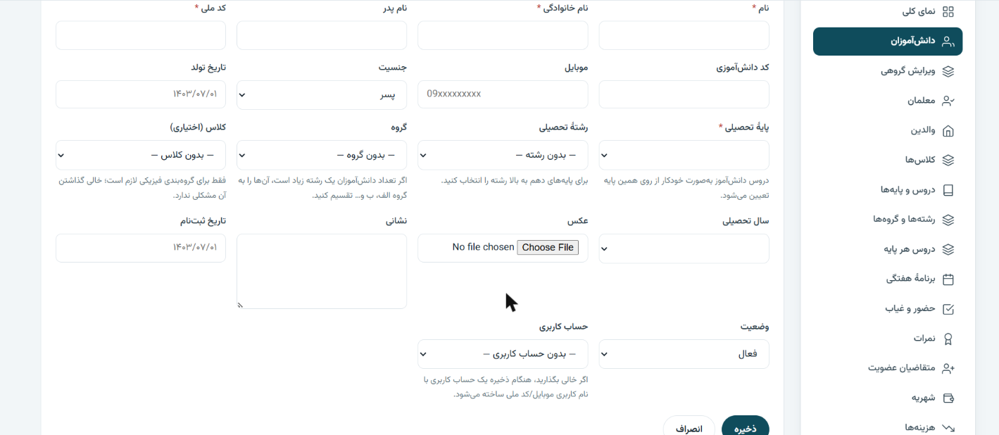

# 🏫 Edu Institute: A Complete School & Academy Management System (WordPress)

**An all-in-one, multi-school management platform built on WordPress, and fully customizable for each school.**
It covers admissions, attendance, grades and report cards, a native online classroom, online exams, tuition, SMS, an AI assistant and much more.

🌐 **Product website:** [koosha-edu.ir](https://koosha-edu.ir/) (sold as **Koosha School Manager**) · 🇬🇧 **English edition:** [koosha-school-manager-en](https://github.com/mohagheghm511/koosha-school-manager-en)

> 🔒 **The source code is private.** This is a commercial product, and this repository is a showcase only. Schools can request a **free 3-day demo** on [koosha-edu.ir](https://koosha-edu.ir/). Custom versions for your school or organization are available on request.

---

## 📌 Overview

Edu Institute is a **full school ERP delivered as a WordPress theme**. It is about **34,000 lines of code** across more than 50 modules, with **60+ database tables**, **6 built-in roles** and **44 fine-grained capabilities**. A single install can run **one school** or **a whole group of schools** (multi-tenant), and every school gets its own branded pages, login portal, dashboards and fully isolated data.

## 🎨 Built to Be Customized for Each School

The system is designed to adapt to how a school actually works, instead of forcing one workflow on everyone:

- **Setup wizard:** choose **single-school** or **multi-institution** mode, then enter the school's name, slogan, logo, city, phone and address. These are used across the site header, report cards and SMS. The wizard can generate the grade structure for elementary, lower-secondary, upper-secondary or academy layouts in one click.
- **Per-school plans and feature toggles:** turn modules on or off for each school (online class, online exam, course shop, registration programs, SMS, library, meals, products, surveys, messaging, discipline, leave, Excel export, reports and charts, calendar, AI assistant, multi-institution), and cap the number of students.
- **Editable role × capability matrix**, with a one-click reset to defaults.
- **Editable front end:** the homepage is a real WordPress page built from movable shortcode blocks, and it is **fully editable in Elementor** with **10 custom widgets** (hero, stats, roles, teaching staff, classes, products, announcements, events, CTA, login form). Full-width and blank-canvas page templates are included.
- **Developer-friendly:** register a new entity through the `edu_entities` filter and the list view, form, validation, saving and admin page are generated automatically. Hooks such as `edu_after_save()` allow custom processing.
- **Custom modules on request:** new features, reports or integrations can be built for a specific school.

---

## ✨ Features

### 👥 People & structure
- Student, teacher and parent records, with **automatic user accounts** and parent-to-children linking.
- Academic years, **multi-year history**, grade promotion rules and an **alumni archive** that keeps current lists fast.
- A **grade-centred curriculum:** define each grade's subjects once (subject, teacher, weekly hours, coefficient) and they apply to every student in that grade. Majors, groups and optional physical classes are supported.
- A weekly timetable, advanced filters and **bulk operations** on every entity.
- **Auto-saved form drafts**, so data is recovered after an internet drop.

### 📋 Daily school operations
| Module | What it does |
|---|---|
| **Attendance** | Group sheet per grade or class, "all present" button, history and attendance percentage, and SMS to parents |
| **Grades & report cards** | Bulk entry and automatic weighting (exam, homework, participation). Printable HTML/PDF report cards with release-time control |
| **Homework** | Attachments, submissions, grading and feedback, assignable to several classes at once |
| **Discipline** | Positive and negative points starting from 20, parent notification and a dedicated table on the report card |
| **Leave requests** | Request, approval, and automatic conversion of absences to "excused" |
| **Announcements** | Targeted audiences, in-app notifications and SMS |
| **Calendar & events** | Exams, holidays, parent meetings, field trips |
| **Surveys** | Multiple-choice and open questions, anonymous responses, aggregated reports |
| **Library** | Catalogue, stock and loans |
| **Meals** | Menu planning and reservations with capacity limits |

### 🎥 Native online classroom (WebRTC, no third-party service)
- A **whiteboard-centred layout**: large board, small teacher video and chat, similar to Skyroom.
- **Upload PDFs and images onto the board** and page through them in sync for everyone.
- Pen with color and width options, eraser, and clear board.
- **"Permission to speak":** the teacher lets a student talk, and the student's mic and camera switch on instantly.
- Echo cancellation, noise suppression and automatic gain control, plus a mobile-first layout with a floating teacher video.
- "Start now" option, duration in minutes, and automatic ending and clean-up.
- Alternatives: **Skyroom API** (automatic room creation with per-user role links) or any manual link (Google Meet, BigBlueButton, Adobe Connect...).

### 📝 Online exams
- A **question bank** with categories and an **exam builder** with randomization.
- Multiple choice, true/false, short answer and essay questions, including **photo upload of handwritten answers**.
- Timer, automatic and manual grading, tracking codes, direct links and violation logging.
- **Scores flow automatically into the report card.**

### 💰 Finance
- Tuition schedules, **installments**, partial payments with manual dates, invoices and receipts.
- Expenses, balance sheet, debtor reports and automatic reminders.
- **12+ Iranian payment gateways**: ZarinPal, Zibal, IDPay, NextPay, PayPing, Vandar, Saman, Parsian, Sepehr, AqayePardakht, BitPay and more.
- **Course shop:** sell video courses with chapters, lessons and a player. **Registration programs** cover paid in-person or online classes. **Educational products** include files, books and sample questions, free or paid.

### 💬 Communication
- **Direct messaging** with privacy rules: a student can only message classmates and their own teachers. Class group chat supports images and pinned messages.
- **SMS (Melipayamak)** with approved patterns and **14 ready-made events** (login code, password reset, account created, membership approved or rejected, absence, new grade, tuition reminder, new homework, online class, announcement, discipline, exam result, leave result).
- **Notification badges** next to each dashboard section.

### 🤖 AI assistant
The school admin enters an API key and model name, and the assistant is ready to use. It works with any **OpenAI-compatible** endpoint (`/v1/chat/completions`), so the provider can be changed by changing the base URL.

### 🏢 Multi-institution (multi-tenant) mode
- A **super-admin** sees the list of schools, opens any school's panel, and views **aggregate statistics** for the whole group.
- **One account can access several schools**, but only through the login portal of the school they are entering. Revoking access ends active sessions immediately.
- Every query is filtered by institution, and a **tenant guard** blocks direct access to another school's records by ID.
- The homepage shows group-wide statistics and a card for each school. Each school has its own page, sign-in and registration.
- **Demo manager:** create trial schools with an expiry date and a private login link, extend them, expire them automatically, and hide them from public view.

### 🔐 Login & security
- Sign in with **mobile number, national ID, student code, username or email**, or with a **5-digit SMS code** (5-minute expiry, 5 attempts, 90-second resend limit).
- Custom password-recovery pages (SMS code or email link), with identical responses whether or not an account exists, to prevent account enumeration.
- Nonces on every form and every AJAX action, `$wpdb->prepare()` on every query, and escaped output throughout.
- Server-side Iranian national ID validation, MIME-restricted uploads and an audit log.
- **No-cache protection** for dashboard pages (compatible with LiteSpeed, WP Rocket and W3TC).

### 🛠️ Administration
- **Repair & health** page: checks tables, roles, pages and records, with one-click rebuild.
- Filtered **Excel export** (styled, RTL, no external library needed).
- Full data wipe for starting fresh after a trial (site owner only).
- Jalali (Persian) calendar throughout, with fully RTL UI.

---

## 👤 Roles

| Role | Access |
|---|---|
| Super-admin (multi-institution) | All schools, aggregate stats, school manager accounts |
| School manager | Full control of their school |
| Deputy | Academic and discipline operations |
| Accountant | Tuition, payments, expenses, financial reports |
| Teacher | Their own classes: attendance, grades, homework, exams, online class |
| Student | Dashboard, schedule, homework, exams, report card, messages |
| Parent | Their children's attendance, grades, discipline and tuition |

## 🧰 Tech Stack
PHP · WordPress (custom tables, roles and capabilities, REST/AJAX, shortcodes) · JavaScript · WebRTC · Elementor · DOMPDF (optional) · Melipayamak SMS API · Iranian payment gateway APIs · OpenAI-compatible LLM API

## 📊 In Numbers
- **~34,000** lines of code · **50+** modules · **60+** database tables
- **6** roles · **44** capabilities · **14** SMS events · **12+** payment gateways · **10** Elementor widgets

---

**Designed and developed by [@mohagheghm511](https://github.com/mohagheghm511)**
Interested in a demo or a custom version for your school? Visit [koosha-edu.ir](https://koosha-edu.ir/) or open an issue.

